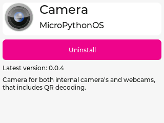
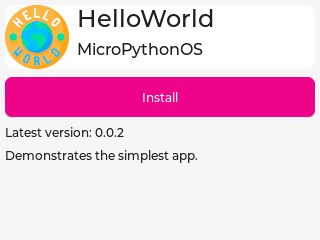
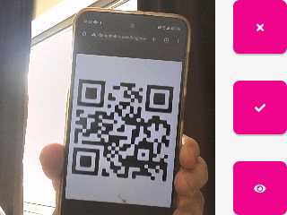

# AppStore

The MicroPythonOS App Store allows users to download and install new apps to extend system functionality.

App discovery is currently done by downloading the app list from [apps.micropythonos.com](https://apps.micropythonos.com).

## Example Apps

- **Hello World**: A sample app demonstrating basic functionality.
- **Camera**: Captures images and scans QR codes.
- **Image Viewer**: Displays images stored in `/data/images/`.
- **IMU**: Visualize data from the Intertial Measurement Unit, also known as the accellerometer.

## Screenshots

  <figure>
    
    <figcaption>Camera App in App Store</figcaption>
  </figure>
  <figure>
    
    <figcaption>Hello World Installation</figcaption>
  </figure>
  <figure>
    
    <figcaption>Camera QR Code Scanner</figcaption>
  </figure>

## Developing Apps

Apps are written in MicroPython and installed in `/apps/`. See [Filesystem Layout](../architecture/filesystem.md) for the app directory structure.
