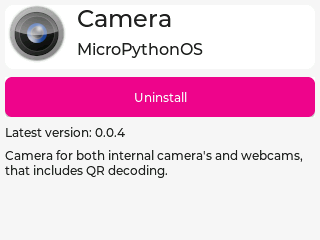
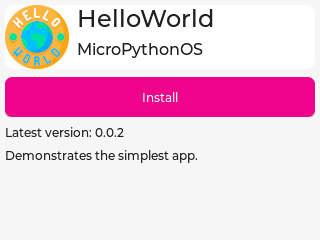
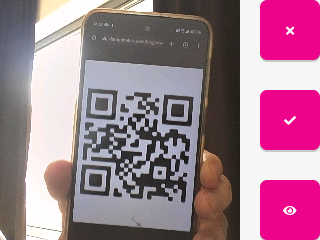

# AppStore

The MicroPythonOS App Store allows users to download and install new apps to extend system functionality.

## Backends

The AppStore app can pull apps from more than one source:

- **BadgeHub.eu** — the community appstore for event badges and community-built apps at [badgehub.eu](https://badgehub.eu). On supported firmware builds this is the default backend. See [BadgeHub Apps](badgehub.md) for details on publishing there.
- **MicroPythonOS Apps** — the curated, manually reviewed app index at [apps.micropythonos.com](https://apps.micropythonos.com).

Use the backend selector in the AppStore UI to switch between sources.

## Example Apps

- **Hello World**: A sample app demonstrating basic functionality.
- **Camera**: Captures images and scans QR codes.
- **Image Viewer**: Displays images stored in `/data/images/`.
- **IMU**: Visualize data from the Inertial Measurement Unit, also known as the accelerometer.
- **Nostr**: A decentralized chat client using the Nostr protocol, shipped as a Python package.
- **Sorter**: A puzzle game where you sort items into the right bins.
- **The Free Lantern Player**: A media player app.
- **Breakout**: A classic brick-breaking game that uses a native C extension module.

## Image Viewer

The **Image Viewer** app displays images stored in `/data/images/`. See [Supported File Formats](../other/supported-file-formats.md) for the list of image formats the OS can decode.

## Screenshots

  <figure>
    
    <figcaption>Camera App in App Store</figcaption>
  </figure>
  <figure>
    
    <figcaption>Hello World Installation</figcaption>
  </figure>
  <figure>
    
    <figcaption>Camera QR Code Scanner</figcaption>
  </figure>

## Developing Apps

Apps are written in MicroPython and installed in `/apps/`. See [Filesystem Layout](../architecture/filesystem.md) for the app directory structure, [Bundling Apps](bundling-apps.md) for packaging, and [Native C/C++ Apps](native-apps.md) for apps that need compiled extensions.
