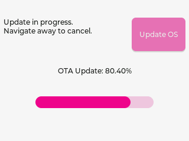

# Built-in Apps

MicroPythonOS includes essential apps to bootstrap the system, located in `/builtin/apps/`.

- **launcher**: Starts apps and provides the home screen.
- **wificonf**: Configures WiFi connections.
- **appstore**: Downloads and installs new apps.
- **osupdate**: Manages Over-The-Air (OTA) system updates.

## Screenshots

  <figure>
    
    <figcaption>Launcher</figcaption>
  </figure>
  <figure>
    
    <figcaption>WiFi Settings</figcaption>
  </figure>
  <figure>
    
    <figcaption>App Store</figcaption>
  </figure>
  <figure>
    
    <figcaption>OS Update</figcaption>
  </figure>

See [App Store](appstore.md) for additional apps.
