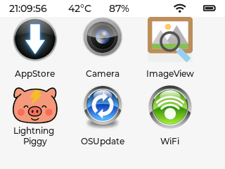
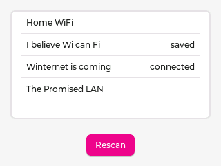
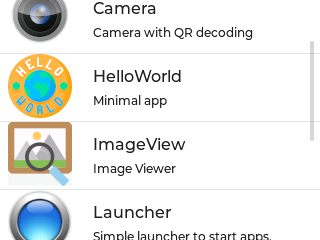
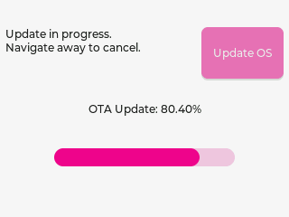

# Built-in Apps

MicroPythonOS includes essential apps to bootstrap the system, located in [`/builtin/apps/`](https://github.com/MicroPythonOS/MicroPythonOS/tree/main/internal_filesystem/builtin/apps).

- **Launcher**: Starts apps and provides the home screen.
- **WiFi**: Configures WiFi connections.
- **AppStore**: Downloads and installs new apps.
- **OSUpdate**: Manages Over-The-Air (OTA) system updates.
- **Settings**: Configuration for MicroPythonOS

## Screenshots

  <figure>
    
    <figcaption>Launcher</figcaption>
  </figure>
  <figure>
    
    <figcaption>WiFi</figcaption>
  </figure>
  <figure>
    
    <figcaption>App Store</figcaption>
  </figure>
  <figure>
    
    <figcaption>OSUpdate</figcaption>
  </figure>

See [App Store](appstore.md) for additional apps.
