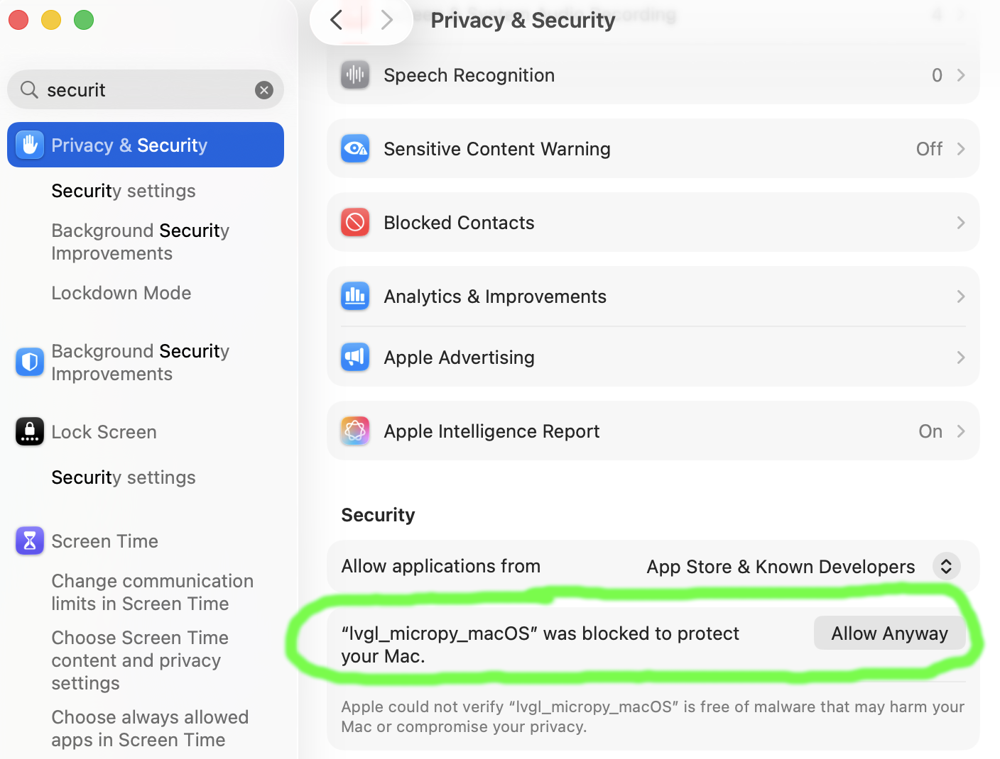

## Running on desktop

1. Make sure you have the `local_filesystem/` folder

    If you built from source, you should already have a local clone that contains the [internal_filesystem](https://github.com/MicroPythonOS/MicroPythonOS/tree/main/internal_filesystem).

    If you used a pre-built binary, then you need to get a local clone and change into that directory with:

    <pre>
    ```
    git clone --recurse-submodules https://github.com/MicroPythonOS/MicroPythonOS.git
    cd MicroPythonOS/
    ```
    </pre>

2. Make sure you have the software

    If you built from source, then you will already have the software in lvgl_micropython/build/lvgl_micropy_*

    If you downloaded a pre-built binary (for example /Users/yourname/MicroPythonOS_amd64_MacOS_0.7.1.bin) then put it in the right location now:

    <pre>
    ```
    mkdir -p lvgl_micropython/build
    cp /Users/yourname/MicroPythonOS_0.7.1.bin lvgl_micropython/build/lvgl_micropy_macOS
    ``` 
    </pre>

3. Starting the software:
    
    You're now ready to run it with:

    <pre>
    ```
    ./scripts/run_desktop.sh
    ```
    </pre>

### Notes on MacOS

If you get an error about a missing /opt/homebrew/opt/libffi/lib/libffi.8.dylib then fix that with: `brew install libffi`

If you get an error about the code being unsigned, then allow it like this:



    

## Making Changes on Desktop

You'll notice that whenever you change a file in `internal_filesystem/`, the changes are immediately visible on desktop when you reload the file or restart the app.

When you run `./scripts/run_desktop.sh`, the OS runs the MicroPythonOS scripts **directly from `internal_filesystem/`**. This means:

- **All changes to Python files are immediately active** - no build or install needed
- **Instant testing** - edit a file, restart the app, see the changes
- **Fast iteration cycle** - the recommended way to develop and test

**Try it yourself:**

1. Edit `internal_filesystem/builtin/apps/com.micropythonos.about/assets/about.py`
2. Run `./scripts/run_desktop.sh`
3. Open the About app
4. See your changes immediately!


## Making Changes on ESP32

Once you've tested your changes on desktop and they work correctly, or you're doing things you can't test on desktop, then you can deploy to physical hardware.

{!os-development/installing-on-esp32.md!}


