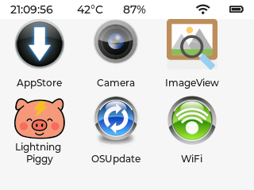
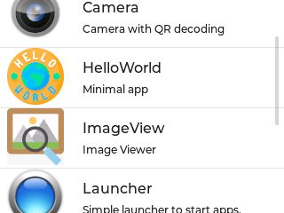
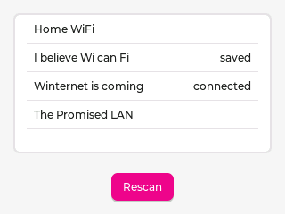

# Overview

MicroPythonOS is a lightweight operating system written entirely in MicroPython, designed for microcontrollers like the ESP32 and desktop environments. Inspired by Android, it adopts a "thin" OS model where everything is an app, making it easy for developers to build and deploy applications.

## Key Features

- **Cross-Platform**: Runs on ESP32, Linux desktops, and potentially MacOS and Raspberry Pi.
- **Touch Screen UI**: Modern, gesture-based interface inspired by Android.
- **App Store**: Download and install apps seamlessly.
- **OTA Updates**: Keep the system and apps up-to-date effortlessly.
- **Hardware Support**: Touch screens, IMUs, cameras, and more.
- **Lightweight**: Optimized for resource-constrained devices with fast boot times.

## Advantages

- **MicroPython Foundation**: Simplifies development with a familiar Python-based language.
- **Cross-Platform Compatibility**: From microcontrollers to desktops, deploy anywhere.
- **Resource Efficiency**: Designed for low-memory and low-power devices.
- **Modern Interface**: Supports touch screens and gestures for intuitive interaction.
- **Extensibility**: Easy to add new apps and features via the App Store.

## Use Cases

MicroPythonOS powers a wide range of applications:

- IoT devices like smart home controllers.
- Educational tools with interactive displays.
- Decentralized payment systems using Bitcoin Lightning.
- Portable touch screen devices and smart wearables.
- Robotics with IMU and camera support.
- Rapid prototyping for DIY projects.

## Screenshots

Explore MicroPythonOS in action:

  <figure>
    
    <figcaption>Launcher</figcaption>
  </figure>
  <figure>
    
    <figcaption>App Store</figcaption>
  </figure>
  <figure>
    
    <figcaption>WiFi Settings</figcaption>
  </figure>

[See more screenshots](#screenshots)
